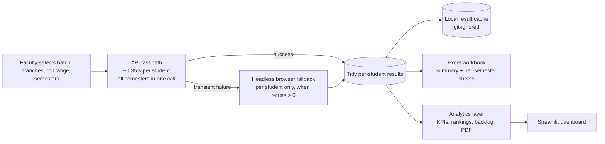

# GradePulse

> **Bulk-fetch student exam results from the college examination portal, export Excel reports, and get pass/fail & subject-level analytics for any year/semester.**


## Authorized Use Only

> **This tool is intended solely for authorized institutional use by designated faculty/staff.**
> It must not be run, forked, or deployed without explicit authorization from the relevant
> academic institution. Access to the deployed tool is restricted to authorized personnel only.

GradePulse fetches each student's results automatically and turns them into
clean Excel reports and analytics. It is an internal faculty tool — treat the
data it reads and produces as confidential academic records.

## Access Control

Access is gated behind an authentication layer — **institutional email +
password** — before any fetch, analytics, or download feature is reachable;
no student data is readable without an authorized session. It is an
admission-control gate (domain-restricted email plus a shared credential),
**not** a per-user identity/SSO system — treat it as a first line of defence,
not as a substitute for keeping the repository, the data, and the deployed
link restricted to authorized personnel. Implementation specifics (how the
gate works internally) are intentionally omitted here.

Keep this repository **private** — portal-integration code has no place in a
public repo.

## What it does

- **Bulk fetch, fast** — portal JSON API, **~0.35 s per student**, all
  semesters in a single call, with an automatic silent browser fallback per
  student if the API hiccups (no admin credentials are used; each student is
  fetched via their own portal account).
- **Excel reports** — `Summary` sheet + one sheet per semester (subject-name
  columns), with FAILED / F-grade highlighting.
- **Pass/fail analytics** — three definitions (Promoted / Clean pass /
  Subject pass-rate) across any selected scope, per-semester tables, a
  combined 4th-year row, subject failure ranking, branch comparison.
- **Backlog tooling** — failed-subject report searchable by roll number, plus
  a per-student backlog CSV and an on-demand PDF report.
- **Scoped by design** — analytics always reflect exactly the batch, branch
  and roll range you pick in that run; login-failed students are excluded and
  listed so you can **re-run just them**.

> **Requirements are tracked in `requirements.md`** — read it first; it is
> the source of truth for behavior.

## Architecture



The 2-tier design means a hard credential rejection never falls back to a
slow browser session (~90 s per affected student avoided), while genuinely
transient API hiccups still get a browser retry.

## Setup

```bash
pip install -r requirements.txt
```

The browser fallback requires a local Chrome install; `webdriver-manager`
handles the driver automatically (see `build_driver()` in `scraper.py`).

## Running it

```bash
streamlit run app.py
```

Faculty then pick batch year and branch(es), roll-number range (regular +
lateral), which semester(s) to pull, and retries per failed student — then
**Fetch & Analytics** generates the Excel workbook. No login fields are
exposed; credentials come from the roll numbers automatically.

Each run also writes a **results cache** (`results_cache/<batch>/`, git-
ignored) as long-format CSV + raw JSON per branch.

## Performance & Benchmarks

| Metric | Value |
|--------|-------|
| 66 students × 6 semesters via API | **~30 seconds** |
| API fetch per student | ~0.35 s (all semesters in one call) |
| Fallback trigger | Automatic, per-student, on API failure |
| Default retries before marking a student failed | 2 |
| Fast mode (`max_retries = 0`) — skip failing student | Immediate (no extra API attempt, no browser) |

## Data Handling

- `results_cache/` and `app_data/` are **git-ignored** — they contain real
  student records and local faculty notes and must never be pushed to a
  repository.
- **Credentials are never stored, logged, or printed**; they are derived from
  each roll number at runtime and discarded after the fetch.
- Retention: fetched results are kept in the local cache as a debugging
  mirror. Delete `results_cache/` when the batch/reporting cycle is done —
  the Excel file you download is the deliverable, and any cached copies
  should be treated like the Excel file itself (don't leave them in shared or
  public locations).

## Security notes

- Keep this repository **private** (portal-integration specifics and real
  data patterns are not for public exposure).
- The downloaded Excel file contains every student's grades — treat it like
  any other sensitive academic record.
- **Reporting a concern:** if you discover a security issue or suspect
  unauthorized access to the tool or its data, contact the developer
  ([Rajendhar Are](https://rajendharare.tech)) or the faculty coordinator
  immediately.

---

**Developed by [Rajendhar Are](https://rajendharare.tech)**